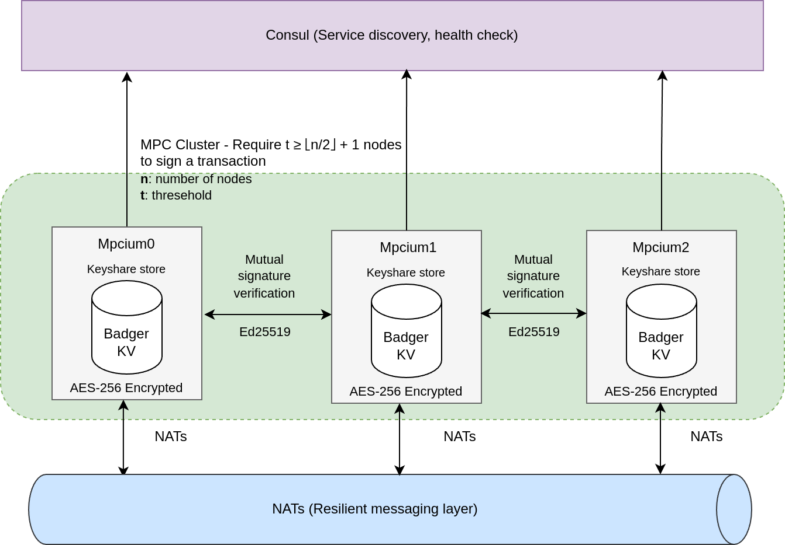

<div class="title-block" style="text-align: center;" align="center">

# mpcium: Resilient MPC (Multi-Party Computation) Nodes for Distributed Crypto Wallet Generation

> _"Setting up MPC wallets has always been painful, complex, and confusing. With MPCIUM, you can launch a secure MPC node cluster and generate wallets in minutes."_

<p></p>
<p><a href="https://t.me/+IsRhPyWuOFxmNmM9">Join our Telegram community to discuss MPCIUM and Web3 cyber security!</a></p>

[](https://go.dev/)
[](./LICENSE)
[](https://goreportcard.com/report/github.com/fystack/mpcium)
[](https://github.com/fystack/mpcium/releases)
[](https://t.me/+IsRhPyWuOFxmNmM9)
[](https://fystack.io)

</div>

Mpcium is a high-performance, open-source Multi-Party Computation (MPC) engine for securely generating and managing cryptographic wallets across distributed nodes—without ever exposing the full private key.

At its cryptographic core, Mpcium integrates tss-lib, a production-grade threshold signature scheme library developed by Binance. It supports:

- **ECDSA (secp256k1)**: Bitcoin, Ethereum, BNB, Polygon, and EVM-compatible L2 chains

- **EdDSA (Ed25519)**: for Solana, Polkadot, Cardano, and other modern blockchains



---

## Resources

- **MPC nodes architecture**: [MPC Fundamental and MPCIUM architecture](https://deepwiki.com/fystack/mpcium)
- **MPC clients**:
  - [TypeScript Client](https://github.com/fystack/mpcium-client-ts)
  - [Golang Client](https://github.com/fystack/mpcium/blob/master/pkg/client/client.go)


## 📦 Dependencies Overview

| Dependency                                          | Purpose                                                                                                                                          |
| --------------------------------------------------- | ------------------------------------------------------------------------------------------------------------------------------------------------ |
| [NATS](https://nats.io)                             | Lightweight and resilient **messaging layer** for coordinating MPC nodes in real time. Enables pub/sub communication even under partial failure. |
| [Badger KV](https://github.com/dgraph-io/badger)    | High-performance **embedded key-value store** used for local encrypted storage of MPC key shares and session data.                               |
| [Consul](https://www.consul.io)                     | **Service discovery and health checking** to allow nodes to dynamically find each other and maintain cluster integrity.                          |
| [tss-lib](https://github.com/binance-chain/tss-lib) | Cryptographic engine for **threshold key generation and signing**, supporting ECDSA and EdDSA (used in Bitcoin, Ethereum, Solana, etc).          |
| [age](https://github.com/FiloSottile/age)           | **Modern encryption tool** used for secure key material storage and protection with password-based encryption.                                   |

## Threshold & Nodes

Mpcium uses a **t-of-n threshold scheme** to securely generate and sign with private keys.

- `n` = total number of MPC nodes (key shares)
- `t` = minimum number of nodes required to sign

Only `t` out of `n` nodes need to participate — the full private key is never reconstructed.

To maintain security against compromised nodes, Mpcium enforces:

```
t ≥ ⌊n / 2⌋ + 1
```

### Example: 2-of-3 Threshold

- ✅ `node0 + node1` → signs successfully
- ✅ `node1 + node2` → signs successfully
- ❌ `node0` alone → not enough shares

This ensures:

- No single point of compromise
- Fault tolerance if some nodes go offline
- Configurable security by adjusting `t` and `n`

## Architecture

### Overview

Each Mpcium node:

- Holds a **key share** in local AES-256 encrypted storage (via Badger KV)
- Participates in **threshold signing** using `tss-lib`
- Communicates over a **resilient messaging layer** using NATS
- Registers itself with **Consul** for service discovery and health checks
- Verifies incoming messages using **Ed25519-based mutual authentication**

### Message Flow & Signature Verification

1. A signing request is broadcast to the MPC cluster through **NATS** as an authenticated event. Each node **verifies the sender's Ed25519 signature** before processing the request.
2. NATS broadcasts the request to the MPC nodes.
3. Each participating node verifies:
   - The **signature** of the sender (Ed25519)
   - The **authenticity** of the message (non-replayable, unique session)
4. If the node is healthy and within the quorum (`t`), it:
   - Computes a partial signature using its share
   - Publishes the result back via NATS
5. Once `t` partial signatures are received, they are aggregated into a full signature.

---

### Properties

- **No single point of compromise**: Keys are never fully assembled
- **Byzantine-resilient**: Only `t` of `n` nodes are required to proceed
- **Scalable and pluggable**: Easily expand the cluster or integrate additional tools
- **Secure peer authentication**: All inter-node messages are signed and verified using Ed25519

## Configuration

The application uses a YAML configuration file (`config.yaml`) with the following key settings:

### Database Configuration

- `badger_password`: Password for encrypting the BadgerDB database
- `db_path`: Path where the database files are stored

### Backup Configuration

- `backup_enabled`: Enable/disable automatic backups (default: true)
- `backup_period_seconds`: How often to perform backups in seconds (default: 300)
- `backup_dir`: Directory where encrypted backups are stored

### Network Configuration

- `nats.url`: NATS server URL
- `consul.address`: Consul server address

### MPC Configuration

- `mpc_threshold`: Threshold for multi-party computation
- `event_initiator_pubkey`: Public key of the event initiator
- `max_concurrent_keygen`: Maximum concurrent key generation operations

## Installation

- **Local Development**: For quick setup and testing, see [INSTALLATION.md](./INSTALLATION.md)
- **Production Deployment**: For secure production deployment with systemd, see [deployments/systemd/README.md](./deployments/systemd/README.md)

## Quick Start

Get up and running with MPCIUM in minutes using our automated setup:

### 1. Generate Node Configurations

```bash
# Generate all node configurations, identities, and Docker setup
make gen-configs
```

This command will:

- Generate 3 MPC nodes with 2-of-3 threshold
- Create all necessary identity files and configurations
- Set up Docker Compose files for easy deployment

### 2. Start Development Environment

```bash
# Start all services (NATS, Consul, and MPC nodes)
make start-dev
```

This will launch:

- NATS messaging server
- Consul for service discovery
- 3 MPC nodes (node0, node1, node2)
- Automatic peer registration

### 3. Stop Development Environment

```bash
# Stop all services
make stop-dev
```

### 4. View Logs

```bash
# View logs from all services
docker-compose -f ./deployments/dev/docker-compose.yaml logs -f

# View logs from a specific node
docker-compose -f ./deployments/dev/docker-compose.yaml logs -f mpcium-node0
```

### 5. Test the Setup

Once all nodes are running, you can test the MPC cluster using the client examples in the `examples/` directory.

**That's it!** Your MPCIUM cluster is now ready for secure wallet generation and signing operations.

## Preview usage

### Start nodes

```shell
$ mpcium start -n node0
$ mpcium start -n node1
$ mpcium start -n node2

```

### Client Implementations

- **Go**: Available in the `pkg/client` directory. Check the `examples` folder for usage samples.
- **TypeScript**: Available at [github.com/fystack/mpcium-client-ts](https://github.com/fystack/mpcium-client-ts)

### Client Usage

Mpcium supports flexible client authentication through a signer interface, allowing you to use either local keys or AWS KMS for signing operations.

#### Local Signer (Ed25519)

```go
import (
    "github.com/fystack/mpcium/pkg/client"
    "github.com/fystack/mpcium/pkg/event"
    "github.com/fystack/mpcium/pkg/types"
    "github.com/google/uuid"
    "github.com/nats-io/nats.go"
)

func main() {
    // Connect to NATS
    natsConn, err := nats.Connect(natsURL)
    if err != nil {
        logger.Fatal("Failed to connect to NATS", err)
    }
    defer natsConn.Close()

    // Create local signer with Ed25519 key
    localSigner, err := client.NewLocalSigner(types.EventInitiatorKeyTypeEd25519, client.LocalSignerOptions{
        KeyPath: "./event_initiator.key",
    })
    if err != nil {
        logger.Fatal("Failed to create local signer", err)
    }

    // Create MPC client with signer
    mpcClient := client.NewMPCClient(client.Options{
        NatsConn: natsConn,
        Signer:   localSigner,
    })

    // Handle wallet creation results
    err = mpcClient.OnWalletCreationResult(func(event event.KeygenResultEvent) {
        logger.Info("Received wallet creation result", "event", event)
    })
    if err != nil {
        logger.Fatal("Failed to subscribe to wallet-creation results", err)
    }

    // Create a wallet
    walletID := uuid.New().String()
    if err := mpcClient.CreateWallet(walletID); err != nil {
        logger.Fatal("CreateWallet failed", err)
    }
    logger.Info("CreateWallet sent, awaiting result...", "walletID", walletID)
}
```

#### Local Signer (P256 with encrypted key)

```go
// Create local signer with P256 key (encrypted with age)
localSigner, err := client.NewLocalSigner(types.EventInitiatorKeyTypeP256, client.LocalSignerOptions{
    KeyPath:   "./event_initiator_p256.key.age",
    Encrypted: true,
    Password:  "your-encryption-password",
})
```

#### AWS KMS Signer

##### Production (IAM Role-based Authentication)

For production environments using IAM roles (recommended):

```go
import (
    "github.com/fystack/mpcium/pkg/client"
    "github.com/fystack/mpcium/pkg/types"
)

func main() {
    // KMS signer with role-based authentication (no static credentials)
    kmsSigner, err := client.NewKMSSigner(types.EventInitiatorKeyTypeP256, client.KMSSignerOptions{
        Region: "us-east-1",
        KeyID:  "arn:aws:kms:us-east-1:123456789012:key/12345678-1234-1234-1234-123456789012",
        // No AccessKeyID/SecretAccessKey - uses IAM role
    })
    if err != nil {
        logger.Fatal("Failed to create KMS signer", err)
    }

    mpcClient := client.NewMPCClient(client.Options{
        NatsConn: natsConn,
        Signer:   kmsSigner,
    })
    // ... rest of the client code
}
```

##### Development with Static Credentials

```go
// KMS signer with static credentials (development only)
kmsSigner, err := client.NewKMSSigner(types.EventInitiatorKeyTypeP256, client.KMSSignerOptions{
    Region:          "us-west-2",
    KeyID:           "12345678-1234-1234-1234-123456789012",
    AccessKeyID:     "AKIA...",
    SecretAccessKey: "...",
})
```

##### LocalStack Development

```go
// KMS signer with LocalStack for local development
kmsSigner, err := client.NewKMSSigner(types.EventInitiatorKeyTypeP256, client.KMSSignerOptions{
    Region:          "us-east-1",
    KeyID:           "48e76117-fd08-4dc0-bd10-b1c7d01de748",
    EndpointURL:     "http://localhost:4566",  // LocalStack endpoint
    AccessKeyID:     "test",                   // LocalStack dummy credentials
    SecretAccessKey: "test",
})
```

##### AWS Cloud Config Variations

```go
// Different regions and key formats
configs := []client.KMSSignerOptions{
    // Key ID only
    {
        Region: "eu-west-1",
        KeyID:  "12345678-1234-1234-1234-123456789012",
    },
    // Full ARN
    {
        Region: "ap-southeast-1", 
        KeyID:  "arn:aws:kms:ap-southeast-1:123456789012:key/12345678-1234-1234-1234-123456789012",
    },
    // Key alias
    {
        Region: "us-east-2",
        KeyID:  "alias/mpcium-signing-key",
    },
}
```

**Note**: AWS KMS only supports P256 (ECDSA) keys, not Ed25519. If you need Ed25519, use the local signer.

## Test with AWS KMS (LocalStack)

For local development and testing with AWS KMS functionality, you can use LocalStack to simulate AWS KMS services.

### Setup LocalStack

1. **Install and start LocalStack:**
   ```bash
   # Using Docker
   docker run -d \
     -p 4566:4566 \
     -p 4510-4559:4510-4559 \
     localstack/localstack
   
   # Or using LocalStack CLI
   pip install localstack
   localstack start
   ```

2. **Configure AWS CLI for LocalStack:**
   ```bash
   aws configure set aws_access_key_id test
   aws configure set aws_secret_access_key test
   aws configure set region us-east-1
   ```

### Create P256 Key in LocalStack

1. **Create a P256 keypair in AWS KMS:**
   ```bash
   aws kms create-key \
     --endpoint-url=http://localhost:4566 \
     --description "Test P-256 keypair for Mpcium" \
     --key-usage SIGN_VERIFY \
     --customer-master-key-spec ECC_NIST_P256
   ```

   Expected response:
   ```json
   {
       "KeyMetadata": {
           "AWSAccountId": "000000000000",
           "KeyId": "330a9df7-4fd9-4e86-bfc5-f360b4c4be39",
           "Arn": "arn:aws:kms:us-east-1:000000000000:key/330a9df7-4fd9-4e86-bfc5-f360b4c4be39",
           "CreationDate": "2025-08-28T16:42:18.487655+07:00",
           "Enabled": true,
           "Description": "Test P-256 keypair for Mpcium",
           "KeyUsage": "SIGN_VERIFY",
           "KeyState": "Enabled",
           "Origin": "AWS_KMS",
           "KeyManager": "CUSTOMER",
           "CustomerMasterKeySpec": "ECC_NIST_P256",
           "KeySpec": "ECC_NIST_P256",
           "SigningAlgorithms": [
               "ECDSA_SHA_256"
           ],
           "MultiRegion": false
       }
   }
   ```

2. **Get the public key (save the KeyId from step 1):**
   ```bash
   export KMS_KEY_ID="330a9df7-4fd9-4e86-bfc5-f360b4c4be39"  # Replace with your KeyId
   
   aws kms get-public-key \
     --endpoint-url=http://localhost:4566 \
     --key-id $KMS_KEY_ID \
     --query PublicKey \
     --output text | base64 -d | xxd -p -c 256
   ```

   Expected response (hex-encoded public key):
   ```
   3059301306072a8648ce3d020106082a8648ce3d030107034200042b7539fc51123c3ba53c71e244be71d2d3138cbed4909fa259b924b56c92148cadd410cf98b789269d7f672c3ba978e99fc1f01c87daee97292d3666357738fd
   ```

### Configure Mpcium for LocalStack KMS

Update your `config.yaml` file with the KMS public key and algorithm:

```yaml
# MPC Configuration  
mpc_threshold: 2
event_initiator_pubkey: "3059301306072a8648ce3d020106082a8648ce3d030107034200042b7539fc51123c3ba53c71e244be71d2d3138cbed4909fa259b924b56c92148cadd410cf98b789269d7f672c3ba978e99fc1f01c87daee97292d3666357738fd"
event_initiator_algorithm: "p256"

# Other configuration...
nats:
  url: "nats://localhost:4222"
consul:
  address: "localhost:8500"
```

### Test KMS Integration

Run the KMS example:

```bash
# Run the KMS example directly
go run examples/generate/kms/main.go -n 1
```

The example will:
1. Connect to LocalStack KMS endpoint
2. Load the P256 public key from KMS
3. Use KMS for signing wallet creation events
4. Generate wallets using the MPC cluster

### Testing

## 1. Unit tests

```
go test ./... -v
```

## 2. Integration tests

```
cd e2e
make test
```
